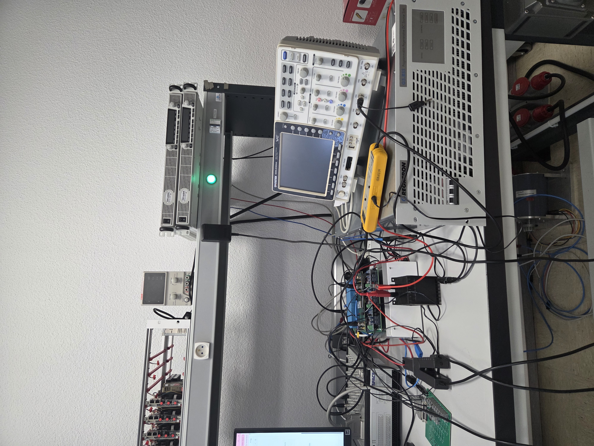
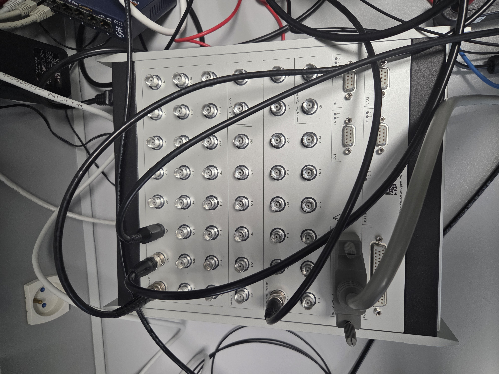
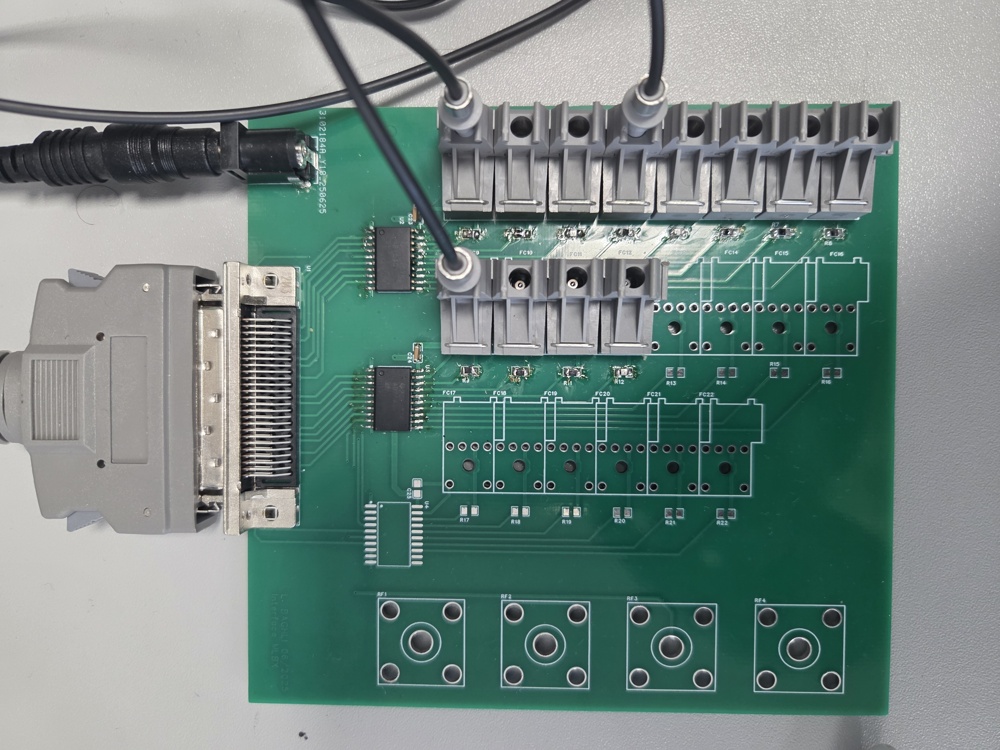
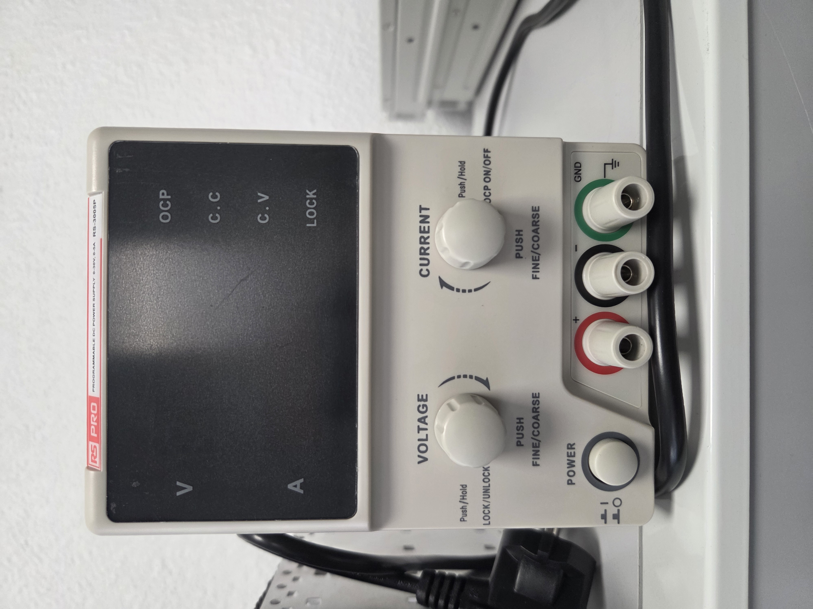
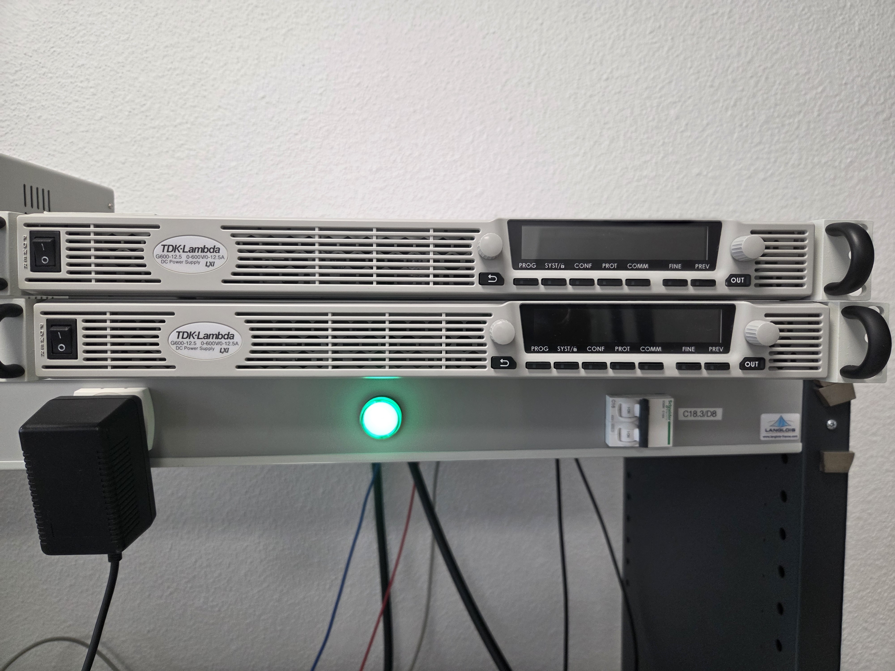
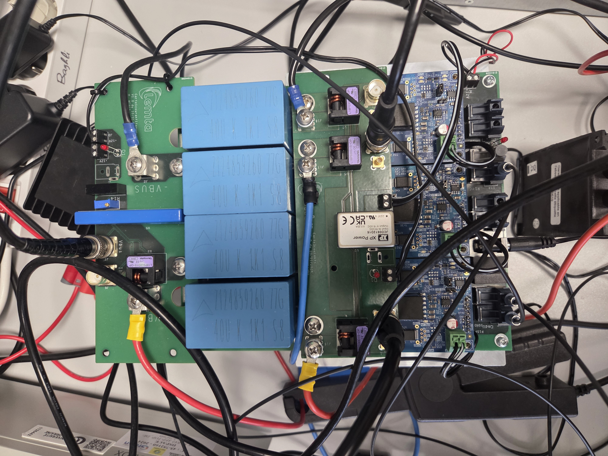
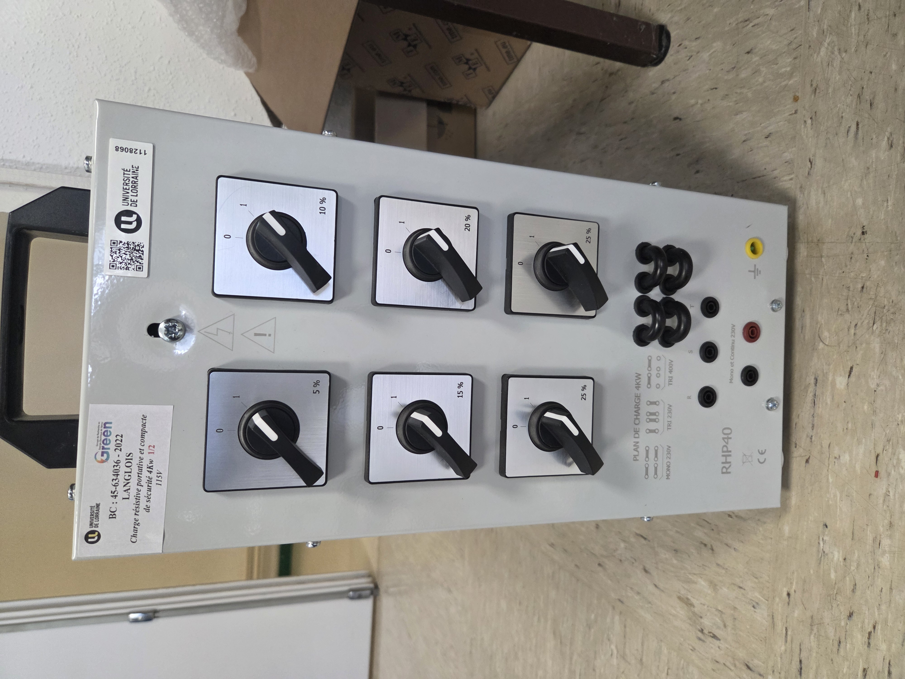
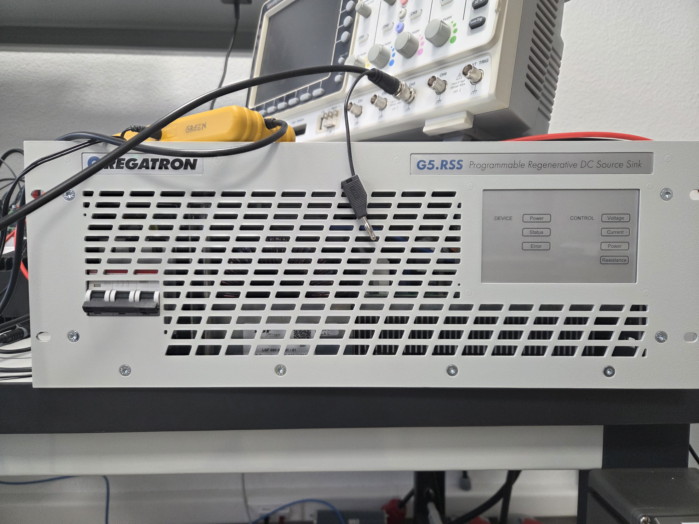
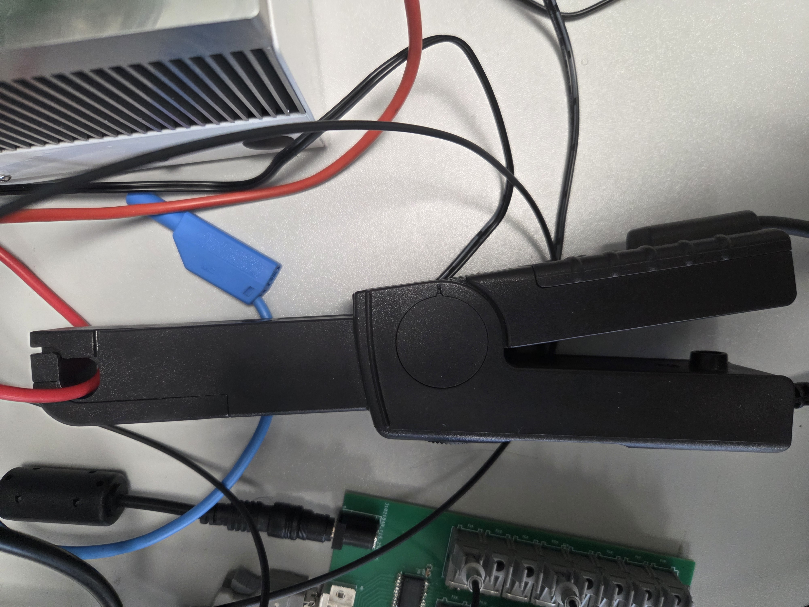
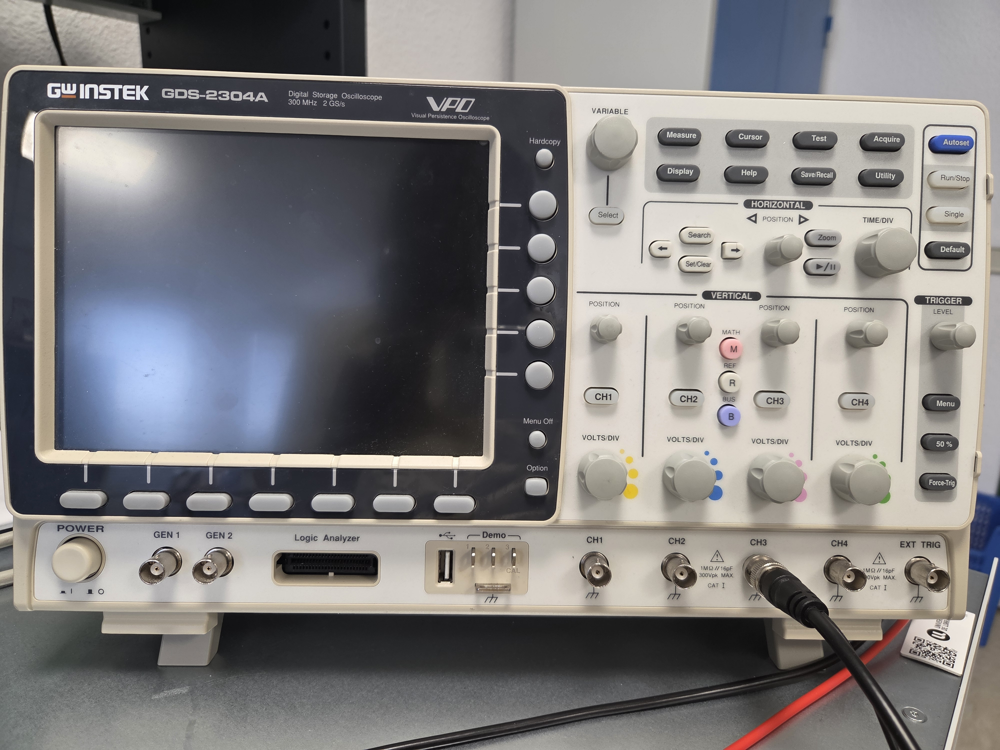

# P-HIL : PV Emulator on dSPACE MicroLabBox II

## Overview
This project implements a Power Hardware-in-the-Loop (P-HIL) emulation of a photovoltaic system, combining a physical PV panel model, an MPPT algorithm, a real hardware buck converter (inverter leg used in synchronous buck configuration), and a battery emulation, all running in real time on a dSPACE MicroLabBox II platform.

The system evolved through several stages, from offline Simulink simulation to full real-time hardware emulation using a programmable power supply (TDK Lambda) as the PV source, a physical buck converter as the power stage, and a bidirectional source-load (Regatron) as the battery.

  

## P-HIL Concept

Power Hardware-in-the-Loop (P-HIL) differs from signal-level HIL in that the signals exchanged between the simulated model and the real hardware carry actual electrical power, not just information.

In this project, the PV panel itself is not physically present. It is emulated in real time by a programmable power supply (TDK Lambda) driven by a mathematical model of the panel.

This emulated source then powers a real hardware buck converter, allowing the MPPT algorithm and the power stage to be tested exactly as they would be with a real panel, without depending on real sunlight, weather conditions, or risking damage to an actual PV module during testing.

## PV Physical Model

The PV panel is modeled using the single-diode equation based on the parameters of a 250W reference panel (Isc, Voc, Vmp, 
Imp, ideality factor, series/parallel resistance, thermal 
coefficients). :

I = Iph − Io [exp((V + Rs·I) / (Vt·a)) − 1] − (V + Rs·I) / Rp

**Panel parameters (250W nominal):**

| Parameter | Value |
|---|---|
| Isc | 8.69 A |
| Voc | 36.6 V (0.61 V/cell × 60 cells) |
| Vmp | 30.55 V |
| Imp | 8.19 A |
| Pmax | 246 W |
| Ideality factor (a) | 1.3 |
| Rs | 0.04/60 Ω |
| Rp | 1271.1/60 Ω |
| Kv (thermal) | -0.0038 V/°C |
| Ki (thermal) | 0.004 A/°C |

**Solving method:** the equation is solved in real time using the Newton-Raphson method, bounded to 10 iterations to guarantee compatibility with the real-time execution constraints of the dSPACE platform.

## Hardware Platform

- **dSPACE MicroLabBox II (DS1203 + DS1303)** - real-time control platform

- **Interface board** - signal conditioning between the MicroLabBox II 
and the buck converter

- **RS PRO Programmable DC Power Supply** - fixed voltage source, used 
in the early stages before the introduction of the TDK Lambda

- **TDK Lambda Programmable DC Power Supply** - emulates the PV panel 
source, driven in real time via DAC

- **Buck converter** - inverter leg used in synchronous buck 
configuration, real hardware power stage

- **Resistive load** - used in the early stages of the project, before 
the introduction of the battery emulation

- **Regatron** - bidirectional source-load, emulates the battery

- **Hall-effect current probe** - current measurement (0.1 V/A)

- **Oscilloscope** - signal validation (PWM, current etc)

**I/O channels used:**
- Digital I/O 14 Channel 1-6 (RF1) - PWM out
- Analog Out 19 Channel 1 - DAC (drives TDK Lambda)
- Analog In 23 Channel 1 - ADC (Vdc measurement)
- Analog In 23 Channel 2 - ADC (current measurement)

  ## Model Evolution

Le projet a évolué à travers plusieurs étapes, chacune permettant de valider une brique du système avant de passer à la suivante.

### 1 - Simulation Simscape hors-ligne

La première étape a permis de valider le modèle du panneau PV (équation à une diode, résolution Newton-Raphson) couplé à un étage de puissance Simscape (convertisseur buck-boost, source de courant contrôlée, charge résistive), avec l'algorithme MPPT tournant directement en simulation. 

Modèle complet disponible dans [`/simulink`](./simulink).

### 2 - Validation de la chaîne de puissance en boucle ouverte

Avant d'introduire le modèle PV en boucle fermée, cette étape a permis de valider isolément la chaîne de puissance physique : une alimentation DC fixe (30V) alimente le hacheur Lemta du laboratoire, piloté en duty cycle par un signal PWM généré par dSPACE (10 kHz), sur une charge résistive simple.

Avec une tension d'entrée connue et fixe, la relation V_sortie = d × E permet de vérifier que le signal PWM commande correctement le hacheur et que la tension de sortie obtenue correspond à la théorie - sans la complexité du modèle PV, isolée à cette étape.

Modèle complet disponible dans [`/simulink`](./simulink).

### 3 - TDK Lambda + hacheur + charge résistive

La TDK Lambda remplace l'alimentation fixe et devient pilotée en temps réel par le modèle PV (Newton-Raphson) via DAC, reproduisant ainsi le comportement électrique du panneau. Le hacheur alimente une charge résistive simple, et le courant est mesuré par une pince de Hall pour reboucler sur le calcul Newton-Raphson.

L'algorithme MPPT (P&O) pilote le duty cycle du hacheur. Un dépassement du courant de court-circuit Isc du panneau a été observé au-delà d'un certain duty cycle, provoquant une divergence du calcul Newton-Raphson. La correction a porté sur le gain de mesure du courant afin repousser ce seuil de manière robuste., bien que cela ne permette pas de se debarasser complétement de cette divergence. Cette dernière dépend aussi grandement des différentes valeurs de l'Irradiance G qu'il nous est possible de modifier à partir de Control Desk. 

Modèle complet disponible dans [`/simulink`](./simulink).

### 4 - Chaîne complète en boucle fermée : PV + MPPT + Regatron

Cette étape assemble l'ensemble de la chaîne P-HIL en boucle fermée et fonctionnelle : panneau PV émulé dynamiquement par la TDK Lambda (pilotée par Newton-Raphson selon le courant mesuré), MPPT actif recherchant le point de puissance maximale par Perturb & Observe, hacheur réversible , et le Regatron comme charge bidirectionnelle réelle en aval. 

La formule du duty cycle est ancrée sur la mesure réelle du bus DC (d = Vdc/V_new) avec Vdc dépendant de notre regatron. Le MPPT converge vers le point de puissance maximale du panneau indépendamment du comportement du Regatron en aval 

### 5 - Émulation dynamique de la batterie (en attente d'intégration)

Cette étape vise à remplacer le réglage manuel et statique de la tension du Regatron par une consigne dynamique calculée, reproduisant le comportement électrique réel d'une batterie : une tension qui 
évolue dans le temps selon son état de charge.

Le SOC (état de charge) est obtenu par intégration du courant batterie (Ibat = dQ/dt), et la tension de consigne suit une courbe Vbatt(SOC) en trois zones - décharge profonde, plateau nominal, charge complète - caractéristique d'une batterie Li-ion ou plomb 12V.

Cette logique de calcul est entièrement construite et validée en isolation dans Simulink. La liaison réelle vers le Regatron est prevue par bus CAN.

Cette configuration permet d'observer le comportement du panneau PV connecté à une vraie batterie, dans des conditions représentatives d'un système photovoltaïque réel.

Modèle complet disponible dans [`/simulink`](./simulink).

## Validation

The system's behavior was verified qualitatively at each stage through the ControlDesk interface, observing the MPPT response to different irradiance (G) and temperature (T) values: duty cycle convergence, operating point stability, and consistency between the voltage imposed by the TDK Lambda and the measured current.

## Key Learnings

This project provided a deep understanding of Power Hardware-in-the-Loop, from the physical modeling of a PV panel to the integration of a storage system:

- **Rigorous physical modeling** - solving the single-diode equation in real time, with hardware-specific constraints (V=f(I), bounded Newton-Raphson iterations)
- **Incremental validation** - isolating each system building block  (converter alone, then PV+MPPT, then active load) before assembling the full chain, for reliable fault diagnosis
- **Diagnosis and correction of real physical faults** - current overshoot, physically ungrounded formulas, identified and corrected through a rigorous engineering approach
- **Real-time embedded constraints** - synchronization of measurement and control loops, hardware limitations (licenses, communication buses)
- **MPPT control** - implementation and robustness of the Perturb & Observe algorithm across changing system topologies
- **Tool proficiency** - hands-on experience with MATLAB/Simulink for physical and control modeling, dSPACE MicroLabBox II as a real-time target platform, ConfigurationDesk for hardware I/O configuration, and ControlDesk for real-time monitoring and parameter tuning
